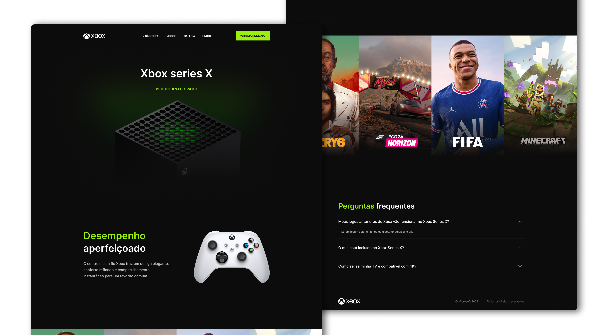

# Xbox-challenge



> Desafio da comunidade Codelândia do Iuri Code. O objetivo era criar uma landing page do Xbox.

## Técnologias utilizadas

- ReactJS
- TypeScript
- Styled-components
- JavaScript

## 💻 Pré-requisitos

Antes de começar, verifique se você atendeu aos seguintes requisitos:

<!---Estes são apenas requisitos de exemplo. Adicionar, duplicar ou remover conforme necessário--->

- Você instalou a versão mais recente do `Node` em sua máquina.

## 🚀 Instalando Xbox-challenge

Para instalar o projeto, siga estas etapas:

- Crie uma pasta chamada Xbox-challenge
- Faça um clone desse repositório na pasta criada

```
git clone https://github.com/MatheusAbreuTech/xbox-challenge.git
```

- Por último, instale todas as dependencias

```
npm install

//ou

yarn install
```

## ☕ Usando Xbox-challenge

Para usar o projeto, siga estas etapas:

- Iniciando o servidor

```
npm run dev

//ou

yarn run dev
```

[⬆ Voltar ao topo](#Xbox-challenge)<br>
